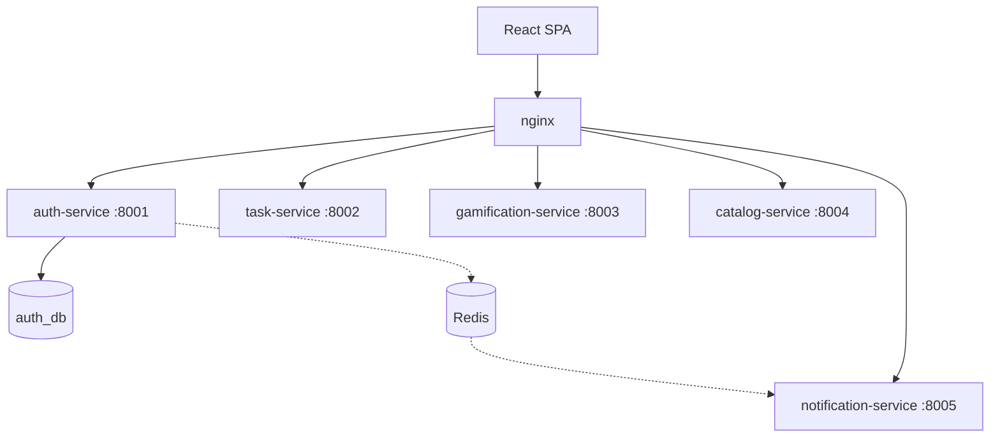

# Microservices Implementation Plan (DIY)

You build this yourself. **Primary goal:** extract the monolith into **auth-service** and separate Django services **without breaking the React frontend or any existing API contracts**.

Long-term target: **5 Django services**, nginx path routing, and (when cross-service features exist) async events via Redis + Celery. **Do not build infrastructure or abstractions until a feature actually needs them.**

---

## Principles (locked)

1. **Frontend stays unchanged** — same URLs, request/response shapes, and JWT claims.
2. **JWT stays as-is** — SimpleJWT + `DJANGO_SECRET_KEY` (HS256). No RS256, no JWKS, no claim renames.
3. **Lift and shift first** — copy working monolith code; refactor later only when necessary.
4. **One service at a time** — add a new service only when you start building its feature.
5. **Incremental cutover** — nginx routes traffic service by service; monolith stays until auth is verified.

---

## When to split (decision rules)

Use this before creating any new service, DB, Redis, or shared package. **Default answer: keep it in auth-service (or the service that already owns the feature).**

### Split into a new service when **2 or more** are true

| Signal | Rule of thumb |
|--------|----------------|
| **Real feature** | You are implementing APIs the frontend (or another service) will call **now** — not “maybe later”. |
| **Own data** | The feature has its own models/migrations that do **not** belong in auth (e.g. tasks, XP, catalog items). |
| **Size** | The new domain is roughly **≥3 endpoints** or **≥2 models** you expect to keep growing. |
| **Pain in one codebase** | Auth deploys/migrations/tests are slowed by unrelated code, or the app folder is hard to navigate. |

If only one row is true → **stay in auth-service** (new Django app under `services/auth-service/` is fine).

### Do **not** split when

- The service would be **empty** (health check only).
- The feature is **frontend-only** so far.
- You are splitting “for architecture” with no user-facing API yet.
- You would add Redis/Celery **before** two services need async communication.

### Team size (practical)

| Team | Guidance |
|------|----------|
| **1 developer (you now)** | Max **2 services** until tasks (or similar) ship: auth + **one** feature service. |
| **2–3 developers** | Split when two people would otherwise edit the same service daily. |
| **4+ or separate teams** | Service per bounded context becomes worth the ops cost. |

### Infrastructure triggers (later)

| Add… | When… |
|------|--------|
| **Second DB** | Same time you create the **second** service — not before. |
| **Redis + Celery** | One service must react to another **without** sync HTTP (e.g. task completed → update XP + send email). |
| **notification-service** | Email/templates are owned by multiple services, or auth feels crowded with mail logic. |
| **RS256 / JWKS** | Non-auth services run in a **different trust zone** (e.g. third-party integrations) and you no longer want shared `DJANGO_SECRET_KEY`. Until then: **shared secret is OK.** |
| **`packages/django_common`** | **Third+** service copies the same JWT/health code — extract once, not at service #2. |

### Quick checklist (30 seconds)

Before `services/foo-service/`:

1. Can I name **≥3 real endpoints** I will ship this month? → if no, wait.
2. Does this data belong in **auth_db**? → if yes, new Django app in auth-service.
3. Will another service need to react **async**? → if no, skip Redis/Celery.
4. Am I the only developer? → if yes, prefer **one feature service at a time**.

**Current status:** auth-service + task-service live → use `./scripts/new-service.sh` for the next service.

### Scaffold a new service

Template: `services/_template/` (JWT + health only — not deployed).

```bash
./scripts/new-service.sh gamification 8003
# or with db + nginx hints:
./scripts/new-service.sh catalog 8004 catalog_db "/api/catalog/,/api/avatars/"
```

Creates `services/<slug>-service/` and prints a checklist for docker-compose, nginx, Makefile, and `.env`. **Does not** start empty containers until you wire infra and add real APIs.

---

## Target architecture (end state — not day 1)



Solid lines = build when needed. Dotted lines = **defer** until async cross-service events are required (e.g. task completion → gamification).

**Locked decisions (when you get there):**

- Monorepo under `services/`
- Django/DRF everywhere
- One Postgres container, **separate DB per service** (create each DB when that service is added)
- Merge progress + engagement → **gamification-service**
- auth-service = **only JWT issuer** (same SimpleJWT config as today)

**Explicitly deferred (do not do upfront):**

- RS256 + JWKS + `actor_type` / `sub` claims
- `packages/shared-contracts/`, `packages/django_common/`
- Redis, Celery, outbox, notification-service
- Empty stub services (task, gamification, catalog)

---

## Frontend compatibility contract (do not break)

The SPA calls `https://localhost/api/...` and expects:

| Area | Endpoints | JWT claims used by frontend |
|------|-----------|----------------------------|
| Parent auth | `/auth/token/`, `/auth/token/refresh/`, `/auth/token/verify/`, `/auth/register/`, `/auth/verify-email/`, `/auth/google/` | `user_id`, `username`, `email` |
| Kid auth | `/auth/kid/token/`, `/auth/kid/token/refresh/`, `/auth/kid/token/verify/`, `/auth/kid/google/`, `/auth/kid/verify-email/` | `role: "kid"`, `kid_id`, `username` |
| Kid signup | `/kids/signup/`, `/kids/signup/google/`, `/kids/invite-parent/` | — |
| Guardian invites | `/guardian-invitations/<token>/`, `/guardian-invitations/accept/` | parent `user_id`, `username`, `email` |

auth-service must keep [`services/auth-service/users/urls.py`](../services/auth-service/users/urls.py), serializers, tokens, and [`SIMPLE_JWT`](../services/auth-service/core/settings.py) settings **identical** unless the frontend is updated in the same PR.

---

## Phase 1 — Extract auth-service ✅

**Goal:** monolith auth runs as `services/auth-service/`; frontend works exactly as before.

**Done in repo:**

1. `services/auth-service/` — copy of monolith auth (same URLs, JWT, serializers).
2. `scripts/init-databases.sh` — creates `auth_db` on first Postgres init; `make init-auth-db` for existing volumes.
3. **docker-compose** — `auth-service` on host port 8001; monolith `backend` removed.
4. **nginx** — `/api/`, `/admin/`, `/static/` → auth-service.
5. **Makefile** — `make migrate` targets auth-service.

**You still need to run locally:**

```bash
make all          # or: docker compose up -d --build && make init-auth-db && make migrate
```

Then verify frontend auth flows (checklist below). If you had user data in the old `transcendence` DB, re-register or migrate data into `auth_db` manually.

---

## Phase 2 — Retire monolith + Makefile ✅

Monolith `backend/` removed from compose and repo; Makefile updated for auth-service.

---

## Phase 3 — task-service ✅

**Goal:** first feature service with real APIs — tasks and completions.

**Done in repo:**

1. `services/task-service/` — Django + DRF, `task_db`.
2. JWT validation via shared `DJANGO_SECRET_KEY` (no auth DB lookup — `KidActor` / `ParentActor` from token claims).
3. nginx routes `/api/tasks/`, `/api/completions/`, `/api/health/` → task-service (before auth catch-all).
4. `make init-dbs` creates `auth_db` + `task_db`; `make migrate` runs both services.

### Task API (via nginx)

| Method | Path | Who | Purpose |
|--------|------|-----|---------|
| GET | `/api/health/` | public | Service health |
| GET | `/api/tasks/` | kid / parent | List tasks (kid: own; parent: optional `?kid_id=`) |
| POST | `/api/tasks/` | parent | Create task for a kid |
| GET | `/api/tasks/<id>/` | kid / parent | Task detail |
| GET | `/api/completions/` | kid / parent | List completions (`?kid_id=`, `?status=` for parent) |
| POST | `/api/completions/` | kid | Submit completion `{ "task_id": "..." }` |
| POST | `/api/completions/<id>/review/` | parent | Confirm/reject `{ "status": "confirmed"|"rejected", "review_note": "..." }` |

**Run locally:**

```bash
make all    # builds task-service, creates task_db, migrates
curl -k https://localhost/api/health/
```

**Next step (backend only — frontend is separate):** document task API in `docs/backend/api_reference.md` and add task-service tests. Frontend team wires dashboards when ready.

### Future service map (reference — build when needed)

| Service | Port | DB | nginx prefix |
|---------|------|-----|--------------|
| auth-service | 8001 | auth_db | `/api/auth/`, `/api/kids/`, `/api/guardian-invitations/` |
| task-service | 8002 | task_db | `/api/tasks/`, `/api/completions/` |
| gamification-service | 8003 | gamification_db | `/api/progress/`, `/api/quests/`, `/api/streaks/` |
| catalog-service | 8004 | catalog_db | `/api/catalog/`, `/api/avatars/` |
| notification-service | 8005 | notification_db | `/api/notifications/` |

---

## Phase 4 — Async events (only when cross-service features need them)

Add when task completion (or similar) must notify gamification + email without sync HTTP:

1. Redis + Celery in docker-compose.
2. `packages/shared-contracts/events.py` — event payloads for that feature only.
3. Outbox in the publishing service; idempotent consumers (dedup key per event).
4. notification-service — move email templates from auth when email volume or templates justify a split.

**Skip entirely until Phase 3 has a real publisher and consumer.**

---

## Phase 5 — First cross-service feature (later)

1. task-service: create/complete tasks (`kid_id` as UUID, no FK to auth).
2. Publish `TaskCompletionConfirmed` → gamification (+ notification if Phase 4 exists).
3. Idempotent consumers using `completion_id` as dedup key.

---

## Verification

### After Phase 1 (required before removing monolith)

| Check | Action |
|-------|--------|
| Parent login | Frontend login + `/api/auth/token/` |
| Kid login | Frontend login + `/api/auth/kid/token/` |
| Parent signup + verify email | Register → verify link works |
| Kid signup + guardian invite | Full kid registration flow |
| Google login | Parent Google sign-in |
| Guardian accept invite | `/guardian-invitations/accept/` |
| Token refresh | Parent and kid refresh endpoints |
| JWT claims | Decode access token — same fields as before (`user_id` / `kid_id`, not `sub`) |
| Admin | `/admin/` via nginx |

### When adding each new service

| Check | Action |
|-------|--------|
| DB exists | `docker compose exec db psql -U $DB_USER -l` |
| nginx route | `curl` the new prefix through nginx |
| JWT on protected routes | Kid/parent token accepted with shared secret |

---

## Common pitfalls

- **Changing JWT claims or algorithm** — breaks Login, Signup, AcceptInvite without frontend changes.
- **Renaming or moving API paths** — frontend uses fixed paths in [`frontend/src/api/auth.ts`](../frontend/src/api/auth.ts).
- **nginx catch-all `/api/` before specific routes** — wrong service gets traffic; order matters.
- **Creating all 5 DBs/services on day 1** — unnecessary; add with each feature.
- **Shared DB between services** — when you split, each service gets its own DB name.
- **Forgetting migrate per service** — each service has its own migration history.
- **Hard cutover** — keep monolith fallback until auth-service passes the Phase 1 checklist.

---

## Suggested work order

| Step | Focus | Status |
|------|-------|--------|
| 1 | Phase 1 — auth-service, `auth_db`, nginx | ✅ |
| 2 | Phase 1 verification — all frontend auth flows | You |
| 3 | Phase 2 — remove monolith | ✅ |
| 4 | Phase 3 — task-service | ✅ |
| 5 | Task API docs + backend tests | Next (backend only) |
| 6+ | Phase 4–5 — Redis/Celery/events when cross-service behavior is required | Later |

---

## Related docs

- [API reference](backend/api_reference.md)
- [User app plan](backend/user_app_plan.md)
- [Database schema](../schema.sql)
